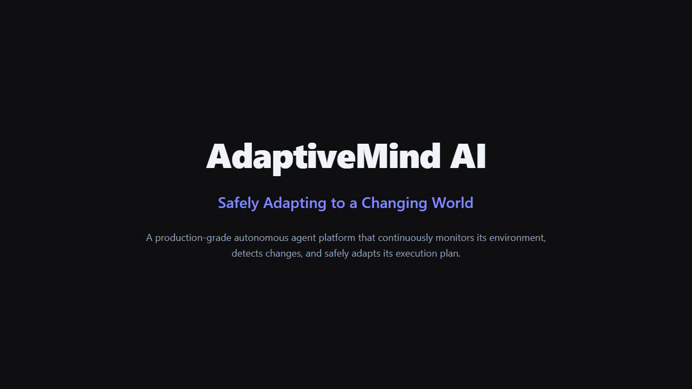

# ��� AdaptiveMind AI
> **Can an AI system recognize that reality changed and safely change its mind?**

[](public/demo.mp4)

AdaptiveMind AI is a production-grade autonomous agent platform that continuously monitors its environment, detects changes, and safely adapts its execution plan — while explaining every decision it makes.


---

## ��� The Core Question

Traditional AI agents execute a plan from start to finish — but reality doesn't stand still. AdaptiveMind AI asks:

> **If the environment changes mid-execution, can the agent recognize the shift, understand its implications, and replan without starting over?**

This project demonstrates **metacognition in autonomous systems**: the ability to reflect on one's own plan, detect when assumptions are invalidated, and generate a safe alternative path.

---

## ��️ Architecture

```
��������������������������������������������������������������┐
│                     UI Layer (Next.js 16)                    │
│  �����������┐ �����������┐ �����������┐ ����������������┐ │
│  �Dashboard │ │ Workflow │ │ Timeline │ │  Simulation   │ │
│  │  (/)     │ │ (/flow)  │ │(/timeline)│ │  (/simulation)│ │
│  �����������┘ �����������┘ �����������┘ ����������������┘ │
│  �����������┐ �������������������������������������������┐  │
│  �Analytics │ │  Components (shadcn/ui + React Flow)     │  │
│  │(/analytics)│ │  CommandPalette │ NotificationCenter    │  │
│  �����������┘ �������������������������������������������┘  │
��������������������������������������������������������������┤
│                    Services Layer (Clean Architecture)       │
│  �����������┐ �����������┐ �����������┐ ����������������┐ │
│  │  Plan    │ │ Env.     │ │ Change   │ │  Adaptive     │ │
│  │  Engine  │ │ Monitor  │ │ Detector │ │  Planner      │ │
│  �����������┘ �����������┘ �����������┘ ����������������┘ │
│  �����������┐ �����������┐ ���������������������������┐   │
│  │ Timeline │ │ Notif.   │ │   Ollama Client (LLM)    │   │
│  │ Service  │ │ Service  │ │   (Optional Reasoning)   │   │
│  �����������┘ �����������┘ ���������������������������┘   │
��������������������������������������������������������������┤
│                  Data Layer (In-Memory Store)                │
│       Plans │ Steps │ Events │ Metrics │ Env. State          │
��������������������������������������������������������������┘
```

### ��� Adaptation Flow

```
����������┐     �������������┐     �����������┐     �����������┐
│  Plan   ������│  Execute   ������│  Detect  │     │  Plan    │
│ Engine  │     │   Steps    │     │  Change  │     │ Complete │
����������┘     �������������┘     �����������┘     �����������┘
                      │                  │
                      ▼                  ▼
               �������������┐    ����������������┐
               │  Step OK   │    │ Change Event  │
               �������������┘    ����������������┘
                                         │
                                         ▼
                                  ���������������┐
                                  │  Adaptive    │
                                  │  Planner     │
                                  ���������������┘
                                         │
                          ������������������������������┐
                          ▼              ▼              ▼
                   �����������┐   �����������┐   �����������┐
                   │ Modify   │   │  Skip    │   │  Add     │
                   │  Step    │   │  Step    │   │  Step    │
                   �����������┘   �����������┘   �����������┘
                                         │
                                         ▼
                                  ���������������┐
                                  │  Resume with │
                                  │  Adapted Plan│
                                  ���������������┘
```

---

## �� Features

### Core Capabilities
- **Planning Engine** — Generates dependency-respecting DAG execution plans
- **Environment Monitor** — Simulates real-world conditions (API status, inventory, permissions, timeouts)
- **Change Detection** — Deep comparison between expected and actual environment state
- **Adaptive Planner** — Recalculates remaining workflow with full explanations for every change
- **Timeline** — Complete chronological event log with search, filter, and replay

### UI/UX
- **Dashboard** — Real-time execution visualization with confidence metrics, risk tracking, and progress
- **Interactive Workflow Graph** — React Flow-powered DAG visualization with live status updates
- **Simulation Center** — 6 preset scenarios for testing agent resilience
- **Analytics** — Charts for adaptation frequency, recovery rates, replan times
- **Command Palette** — ��+K (Ctrl+K) quick navigation
- **Notification Center** — Real-time event notifications
- **Dark Mode** — Automatic theme detection with manual toggle
- **Responsive Design** — Mobile-first layout

### Technical
- �� Clean Architecture with separations of concerns
- �� 30+ unit tests across all services
- �� Docker & Docker Compose support
- �� GitHub Actions CI/CD
- �� Vercel-ready deployment
- �� Full TypeScript strict mode
- �� Accessible (ARIA labels, keyboard navigation)

---

## ��� Quick Start

### Prerequisites
- Node.js 20+
- npm 10+

### Installation

```bash
git clone https://github.com/yourusername/adaptive-mind-ai.git
cd adaptive-mind-ai

npm install
npm run dev
```

Open [http://localhost:3000](http://localhost:3000) in your browser.

### Docker

```bash
docker compose up -d
```

This starts both the Next.js app and an Ollama server for LLM-powered reasoning.

---

## �� Testing

```bash
# Run all tests
npx vitest run

# Watch mode
npx vitest

# With coverage
npx vitest run --coverage
```

---

## ��� Using the Agent

### 1. Start the Agent
Navigate to the **Dashboard** → enter a goal (e.g., "Process a customer order for checkout") → click **Start Agent**.

### 2. Watch Execution
The agent executes steps sequentially, with each step showing its real-time status (pending → in progress → completed).

### 3. Trigger Changes
Go to the **Simulation Center** and run a scenario (e.g., "Payment Gateway Failure"). The agent will detect the change and adapt.

### 4. Observe Adaptation
- **Dashboard** shows confidence dropping and replan count incrementing
- **Workflow Graph** displays the adapted DAG with modified steps highlighted
- **Timeline** logs every event with explanations
- **Analytics** tracks adaptation frequency and recovery rates

### 5. Understand Reasoning
Click **"View Latest Reasoning"** on the Dashboard to see the agent's metacognitive explanation in this format:

```
# Adaptation Report (v1 → v2)

Reasoning:
  Change detected: API Failure: payment-api
  Impact assessment: Blocking all operations dependent on payment-api
  High risk detected. Proactive adaptation initiated.
  Adaptation strategy: Preserve completed steps (2 complete),
  recalculate remaining 8 steps.

Changes made:
  - [MODIFIED] Process Payment (step-4)
    Reason: API unavailable. Adding retry with exponential backoff.
  - [MODIFIED] Complete Order (step-9)
    Reason: Dependency Process Payment is degraded.

Original confidence: 85%
New confidence: 73%
Adaptation time: 12ms
```

---

## ��� Scenario Presets

| Scenario | Category | Description | Risk |
|----------|----------|-------------|------|
| Payment Gateway Failure | `api_failure` | Payment API returns 503 | High |
| Inventory Stockout | `inventory_change` | Popular product stock drops to 10 | High |
| Admin Permission Revoked | `permission_change` | Admin access removed mid-session | Critical |
| User Cancellation | `user_request_change` | User cancels during processing | Medium |
| Multi-Service Cascade | `mixed` | Cascading failures across 3 services | Critical |
| Random Environment Noise | `random` | Continuous random changes | Variable |

---

## �� Analytics

- **Adaptation Frequency** — Bar chart of adaptations per day
- **Replan Time** — Average, min, and max adaptation duration
- **Failure Types** — Categorized failure breakdown
- **Confidence History** — Agent confidence over the execution timeline
- **Recovery Success Rate** — Overall recovery effectiveness

---

## �� API Endpoints

| Endpoint | Method | Description |
|----------|--------|-------------|
| `/api/agent` | GET | Get current agent state, metrics, and events |
| `/api/agent` | POST | Start/stop/reset agent, get explanations |
| `/api/simulation` | POST | Trigger scenarios or individual events |
| `/api/events` | GET | Get all timeline events |

### POST `/api/agent`

```json
{ "action": "start", "goal": "Process a customer order" }
{ "action": "stop" }
{ "action": "reset" }
{ "action": "explain" }
{ "action": "ollama", "prompt": "Why did you adapt?" }
```

### POST `/api/simulation`

```json
{ "scenarioId": "payment-failure" }
{ "event": { "type": "api_failure", "target": "auth-api", "payload": {} } }
```

---

## ��️ Tech Stack

| Technology | Purpose |
|------------|---------|
| Next.js 16 | React framework with App Router |
| TypeScript 5 | Type safety |
| Tailwind CSS 4 | Utility-first styling |
| shadcn/ui | Accessible component primitives |
| React Flow (@xyflow/react) | Interactive workflow DAG |
| Recharts | Analytics charts |
| Lucide React | Icons |
| Motion (Framer Motion) | Animations |
| Ollama | Local LLM reasoning |
| Vitest | Unit testing |
| Docker | Containerization |

---

## �️ Vercel Deployment

[](https://vercel.com/new)

1. Push to GitHub
2. Import to Vercel
3. Deploy — zero configuration required

> **Note:** The in-memory store resets on each deployment. For persistent data, integrate with Vercel KV or a database.

---

## ��� Project Structure

```
src/
��─ app/
│   ��─ page.tsx              # Dashboard
│   ��─ simulation/page.tsx   # Simulation Center
│   ��─ timeline/page.tsx     # Timeline
│   ��─ analytics/page.tsx    # Analytics
│   ��─ flow/page.tsx         # Workflow Graph
│   ��─ layout.tsx            # Root layout
│   ��─ globals.css           # Global styles + CSS variables
│   ��─ api/
│       ��─ agent/route.ts    # Agent control API
│       ��─ simulation/route.ts # Simulation API
│       ��─ events/route.ts   # Events API
��─ components/
│   ��─ ui/                   # shadcn/ui primitives
│   ��─ layout/               # Sidebar, Header, CommandPalette, etc.
��─ services/
│   ��─ agent-service.ts      # Main orchestrator (singleton)
│   ��─ plan-engine.ts        # Plan generation
│   ��─ environment-monitor.ts # Environment simulation
│   ��─ change-detector.ts    # Change detection
│   ��─ adaptive-planner.ts   # Adaptive replanning
│   ��─ timeline-service.ts   # Event log management
│   ��─ notification-service.ts # Notification system
│   ��─ ollama-client.ts      # LLM integration
��─ types/index.ts            # TypeScript types
��─ lib/utils.ts              # Utility functions
```

---

## ��� Contributing

1. Fork the repository
2. Create a feature branch: `git checkout -b feature/amazing-feature`
3. Commit: `git commit -m 'Add amazing feature'`
4. Push: `git push origin feature/amazing-feature`
5. Open a Pull Request

---

## ��� License

MIT — see [LICENSE](LICENSE) file.

---

## ��� Philosophy

> "The measure of intelligence is the ability to change." — Albert Einstein

AdaptiveMind AI embodies this principle. Traditional AI agents are rigid — they follow a plan and fail when reality diverges from expectations. AdaptiveMind AI represents a shift toward **metacognitive agents** that can:
1. **Monitor** their own execution context
2. **Detect** when assumptions are invalidated
3. **Understand** the implications of change
4. **Adapt** without discarding prior work
5. **Explain** their reasoning transparently

This is not just a demo — it's a blueprint for the next generation of autonomous systems that operate safely in dynamic, unpredictable environments.

---

> **built by Halima Hafir**

